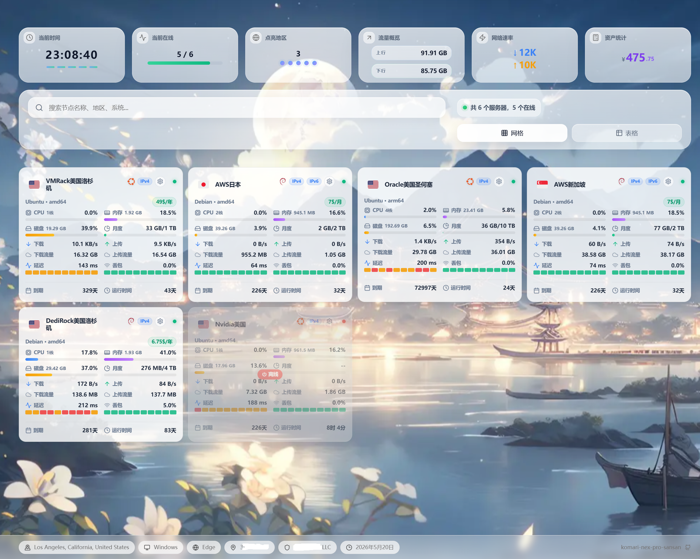
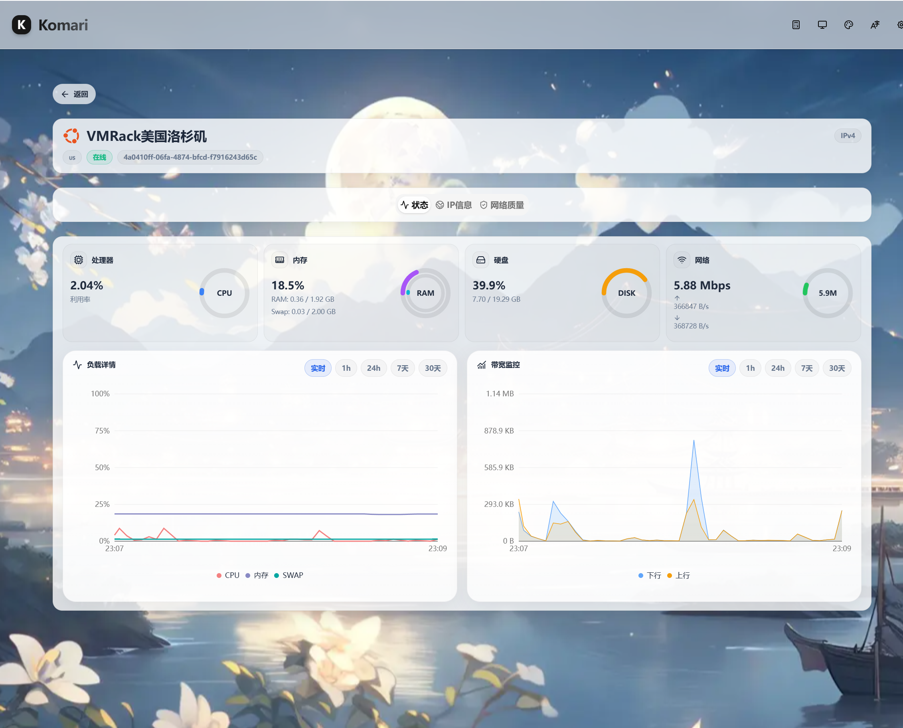
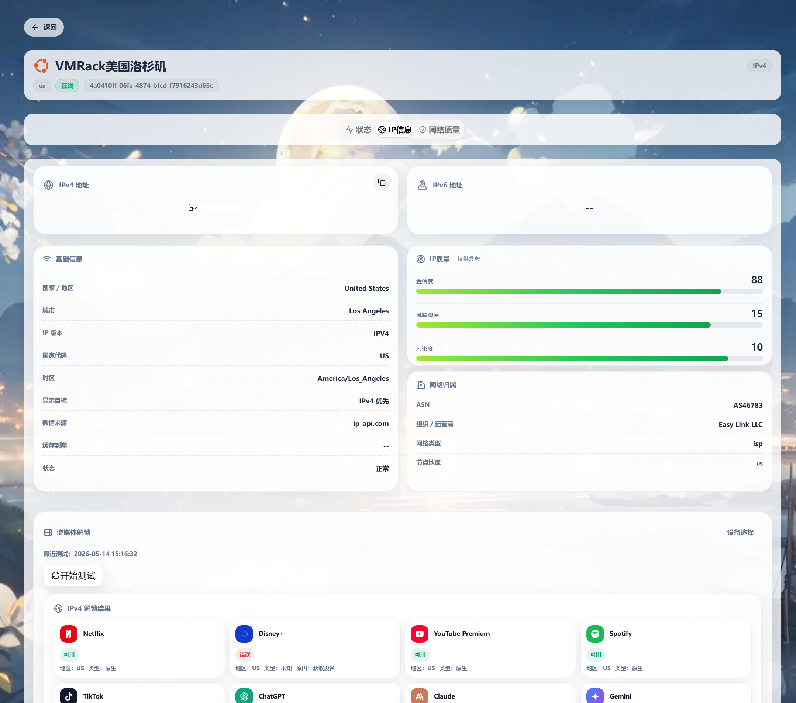
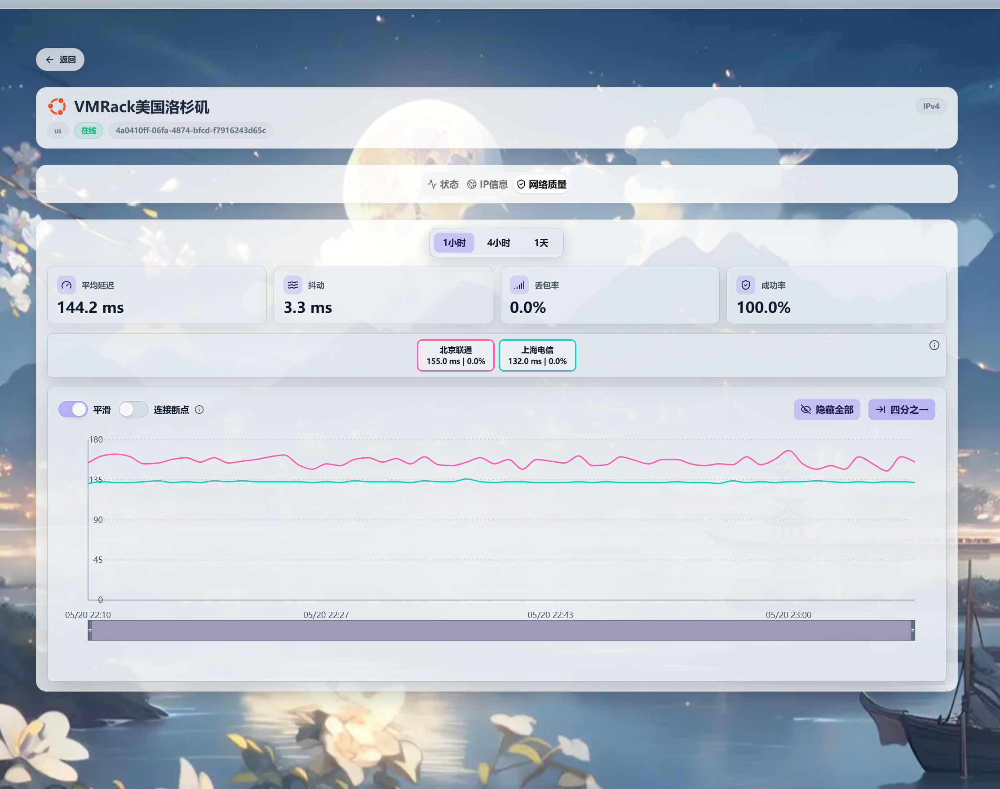
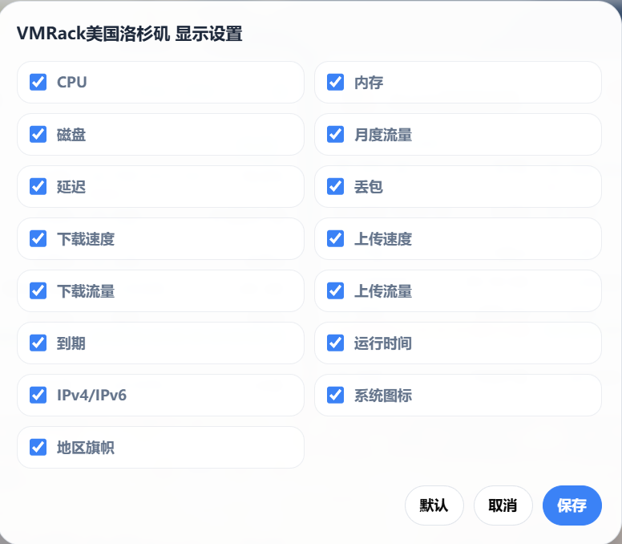

# Komari Next Pro Sansan

Komari Next Pro Sansan是一个 Komari 自定义主题，在 `komari-next-pro` 的基础上修改，主要是修改了界面的一些显示参数，按照个人喜好使用AI进行修改的，基于`komari-next-pro` 1.3.6版本。

## 项目简介

本仓库分为两个模块：

- `theme/` —— Komari 前端主题
- `unlock-probe/` —— 可选后端，用于流媒体解锁探测与节点卡片字段配置

你可以只使用主题，也可以把主题和后端一起部署，获得完整体验。

## 功能特性

### 主题部分
- 现代化主页与 dashboard 布局
- 重做的节点卡片与详情页
- 更丰富的 IP 信息与网络质量展示
- 资产统计与更强的视觉表现
- 可接入 Komari admin 的主题配置支持
- 更好的公开展示隐私管理
- 多语言 UI 基础

### 可选 unlock-probe 后端
- 支持手动触发流媒体解锁检测
- 展示最近一次缓存结果
- IPv4 / IPv6 分离显示
- 支持每节点卡片字段显隐配置
- 支持定时批量检测
- 写操作需登录，公开结果可脱敏输出
- 对敏感解锁详情提供更适合公开访问的隐私保护展示

## 仓库结构

```text
.
├── theme/
├── unlock-probe/
├── docs/
├── scripts/
├── README.md
├── README-CN.md
├── SECURITY.md
├── .env.example
└── docker-compose.yml
```

## 快速开始

### 方案 A：仅部署主题

如果你只想使用 Komari Next Pro 的前端界面：

```bash
cd theme
npm install
npm run build
```

构建完成后，将产物与 `theme/komari-theme.json` 一起上传到 Komari 的主题目录。

### 方案 B：主题 + unlock-probe 一起部署

如果你需要流媒体解锁展示、缓存结果和节点卡片字段控制：

1. 构建并部署 `theme/`
2. 部署 `unlock-probe/`
3. 使用反向代理把 `/unlock-probe/` 转发到后端
4. 配置环境变量，例如：
   - `KOMARI_BASE`
   - `KOMARI_USER`
   - `KOMARI_PASS`
   - `UNLOCK_PROBE_PORT`

你也可以直接使用仓库中的 `docker-compose.yml` 启动后端。

## Theme 模块

`theme/` 目录是 Komari 主题本体。

主要目标：
- 优化首页展示
- 重做节点卡片与详情页 UI
- 提供更丰富的 IP / 网络质量信息
- 支持与 companion probe 后端联动

构建方式：

```bash
cd theme
npm install
npm run build
```

## Unlock Probe 模块

`unlock-probe/` 目录是可选后端服务。

主要职责：
- 执行探测流程
- 提供最近一次缓存解锁结果
- 管理卡片字段显隐配置
- 支持定时批量执行

示例启动方式：

```bash
cd unlock-probe
PORT=19116 \
KOMARI_BASE=http://127.0.0.1:25774 \
KOMARI_USER=admin \
KOMARI_PASS=change-me \
node server.mjs
```

## 一键安装 unlock-probe

你可以直接通过 Release 附件安装可选的 unlock-probe 后端：

```bash
curl -fsSL -o install-unlock-probe.sh https://raw.githubusercontent.com/fanchengliu/komari-next-pro/main/scripts/install-unlock-probe.sh
bash install-unlock-probe.sh
```

也支持通过环境变量覆盖参数，例如：

```bash
INSTALL_DIR=/opt/komari-next-pro-unlock-probe \
KOMARI_BASE=http://127.0.0.1:25774 \
KOMARI_USER=admin \
KOMARI_PASS='你的密码' \
UNLOCK_PROBE_PORT=19116 \
bash install-unlock-probe.sh
```

## 部署说明

### 反向代理

仓库中提供了一个最小 Nginx 示例：

```text
docs/nginx-example.conf
```

### 定时任务

systemd timer 参考说明位于：

```text
docs/systemd-timers.md
```

## 部分截图展示

### 首页 dashboard



### 实例状态页



### IP 信息与流媒体解锁



### 延迟展示



### 卡片隐私与显示设置



## 当前状态

仓库完整开源。  
不断优化改进。

## 贡献者

- Codex

## License

见 [LICENSE](./LICENSE)。
